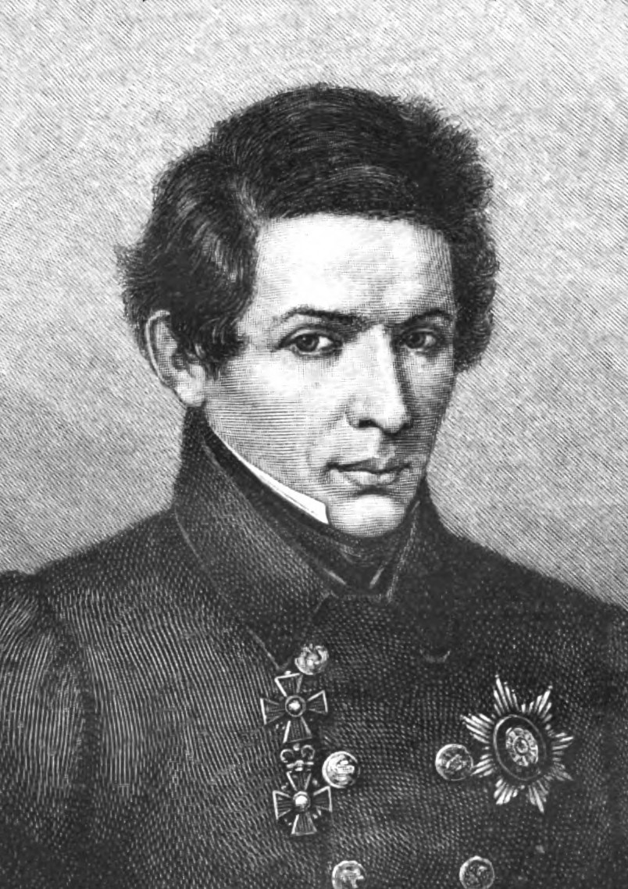

I've been thinking about Lobachevsky.



Well, really I've been thinking about the song that Tom Lehrer wrote.

<iframe width="560" height="315" src="https://www.youtube.com/embed/rCr-vUHanQM?si=kROOFk3w5Xj-BxX2" title="YouTube video player" frameborder="0" allow="accelerometer; autoplay; clipboard-write; encrypted-media; gyroscope; picture-in-picture; web-share" referrerpolicy="strict-origin-when-cross-origin" allowfullscreen></iframe>

I wrote a song, too. It turns out that it hits the ears in a lot of the same vital organs.

<audio controls>
  <source src="slavic_dance_draft.mp3" type="audio/mpeg">
  Your browser does not support the audio element.
</audio>

Nikolai Lobachevsky unambiguously, independently formulated an original theory of Non-Euclidian Geometry and published it in 1829 (O'Conner and Robertson, *Lobachevsky*). "Non-Euclidan", by the way, simply mean a geometry where two parallel lines can meet. That doesn't happen on a flat plane. Two West-going Zaxes will never cross paths. That *is*, however, what happens with parallel lines on the surface of a sphere or a horse's saddle. 

```{Python}
fig = plt.figure(figsize = (17,17))

#####################################################################

x = np.arange(-10, 10, 0.25)
y = np.arange(-10, 10, 0.25)
X, Y = np.meshgrid(x, y)
Z = X**2 - Y**2

ax1 = fig.add_subplot(1, 2, 1, projection = '3d')
A = ax1.plot_surface(X, Y, Z, cmap = 'copper')
ax1.set_title('$f(x, y) = {x^2} - {y^2}$', fontsize = 17)

######################################################################

x = np.arange(-10, 10, 0.25)
y = np.arange(-10, 10, 0.25)
X, Y = np.meshgrid(x, y)
Z = X**2 - Y**2

ax2 = fig.add_subplot(1, 2, 2)
AA = ax2.contour(X, Y, Z, cmap = 'copper', levels = 20)
ax2.set_aspect('equal')
ax2.set_title('$f(x, y) = {x^2} - {y^2}$', fontsize = 17)

#######################################################################
```

Anyway, Lobachevsky and another mathematician named János Bolyai worked on this subject at around the same time. Bolyai first published two years after Lobachevsky's formulation, though. Carl Gauss is in there, too (as always), but he had too many ideas to begin with and thus never bothered publishing these (O'Connor and Robinson, *Bolyai*).

It bears repeating. There is no reason to even *suspect* that Nikolai Lobachevsky plagiarized anyone. There were no accusations during his lifetime, and the only person who anticipated him (privately, crucially) was the same guy that invented about a third of math overall.

But this song, dude, it comes out in 1953 and every junior science club poindexter listens to it and it pervades popular culture **utterly**(Lehrer). To the point where a NYT article about plagiarism from 2002 mentions that Lobachevsky was "...cleared of all wrongdoing" in its third paragraph (Rothstein). He was never *cleared* of wrongdoing! Because he was never accused! It's like when a shady lawyer asks "when did you stop dealing cocaine?" 

I wasn't thinking about Tom Lehrer when I composed that song above. I was thinking about the melody. But it sounds a lot like the *Tetris* theme, too, doesn't it? And that's an intersection of Russians and Mathematics. Is it inspired by those things, or just derivative of them? Or is it a natural consequence of writing in Hungarian Minor? Speaking of Hungarian minors, Bolyai almost ended up as Gauss's apprentice, but the man was too busy. Bolyai is largely forgotten because he spent his life isolated away from the bulk. of the European mathematics community (O'Connor and Robinson, *Bolyai*). I wonder what would have changed?

Math is all about truth. But that's only half-true. It's mostly about truth, and the rest is about ego. Lobachevsky made a really important contribution to the field. Well, so did Bolyai. But Lobachevsky published an article about it first. So do they share credit? Does it matter?

Everyone in mathematics or any other creative field, at every level of ability, needs to ask at some point why they do it. Would you want to find something new if nobody was around to see it? Why do you care about advancing the field when the most responsible-sounding rationale-- the good of humanity-- is abstracted from your work through so many levels that the connection is really just an academic one? Why do I care if I'm "great" or "notable"? 

What if I'm not?

::: {.callout-caution collapse="true"}

## References 

Lehrer, Tom. "Lobachevsky." Songs by Tom Lehrer, Lehrer Records, 1953. YouTube, https://www.youtube.com/watch?v=rCr-vUHanQM. Accessed 23 Jul. 2026.

image public domain via Wikimedia Commons
https://upload.wikimedia.org/wikipedia/commons/0/09/Nikolai_Lobachevsky.jpg

O'Connor, J. J., and E. F. Robertson. "Nikolai Ivanovich Lobachevsky." MacTutor History of Mathematics Archive, School of Mathematics and Statistics, University of St Andrews, https://mathshistory.st-andrews.ac.uk/Biographies/Lobachevsky/. Accessed 23 Jul. 2026.

O'Connor, J. J., and E. F. Robertson. "János Bolyai." MacTutor History of Mathematics Archive, School of Mathematics and Statistics, University of St Andrews, https://mathshistory.st-andrews.ac.uk/Biographies/Bolyai/. Accessed 23 Jul. 2026.

Rothstein, Edward. "Connections; Plagiarism That Doesn't Add Up." The New York Times, 9 Mar. 2002, https://www.nytimes.com/2002/03/09/books/connections-plagiarism-that-doesn-t-add-up.html. Accessed 23 Jul. 2026.
:::